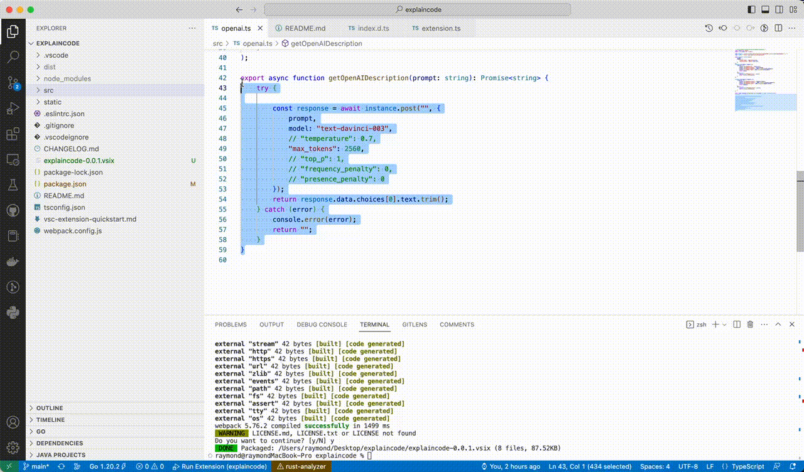
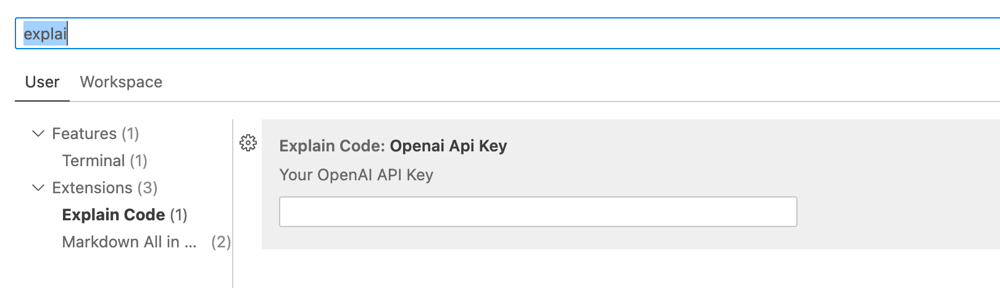

# Description

Explain Code by chatgpt

# API Key Setup

1. press `cmd+shift+p`
2. search `Preferences: Open Settings (UI)`
3. press `Enter`
4. search property: `Openai Api Key`
5. insert your own api key

# Usage

1. select codes which you want chatgpt to explain
2. press `cmd+shift+p`
3. search command: `Explain Selected Code`
4. press `Enter`, run the command, and wait for chatgpt to return the explained code